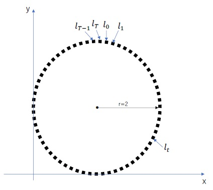
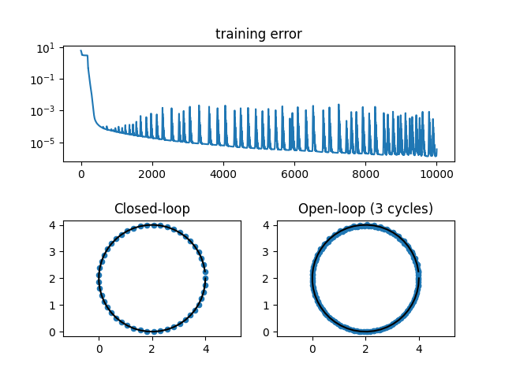

# Assignment 3: drawing a circle by recurrent neural network (RNN)

Implement an RNN model that can draw a circle. The circle is divided into 50 points $`\{l_t\}_{t=0}^{t=T-1} (T=50)`$ and the RNN should be able to predict point $`l_{t+1}`$ from $`l_{t}`$. When drawing the circle (inference time), the RNN model only has access to starting point $`l_{0}`$ and does not have access to the points $`l_{1}`$ to $`l_{T-1}`$. This is what commonly known as what is called an open-loop policy and the RNN model uses predicted output as an input. There is no validation dataset in this problem and plot the open-loop prediction.



## Script files

- ```dataset.py```: Provide training data of shape $`[N, L, H_{in}]`$, where $`N`$ is batch size, $`L`$ is sequence length, and $`H_{in}`$ is input size.
- ```model.py```: The RNN class implementation. ```torch.nn.RNNCell``` is used for the hidden layer.
- ```train_rnn.py```: The main script to train the RNN model.

## Learning result

In ```train_rnn.py```, the RNN model has 64 hidden neural units. The initial learning rate of Adam optimizer is set as 0.001, and learnable parameters of the RNN are updated for 10,000 times. The training loss and predicted points by closed- and open-loop policies shown in the figure. In the open-loop policy case, the RNN is imposed to predict 150 steps into the future. Therefore, the predicted points would draw three cycles of circle (50 steps per cycle).



## Checkpoints

1. Is the training data is correct?
    - Radius: $`r=2`$,
    - Center: $`(2, 2)`$,
    - 50 steps.
1. The RNN model
    - inherits ```nn.Module```,
    - has ```__init__``` function,
    - includes at least one ```nn.RNNCell```,
    - overrides ```forward``` function.
1. Does the RNN use a proper activation in the output layer? Consider the range of predicted output.
    - For instance, if the RNN uses ```tanh``` for outputs, the range of predicted outputs becomes $`(-1.0, 1.0)`$ but the range of training data is $`[0.0, 4.0]`$. So ```tanh``` is NOT proper for this training.
1. The training data must be fed as sequences.
1. After training, can the RNN predict by using open-loop policy?
    - Open-loop policy means the predicted outputs are reused as the next inputs.
