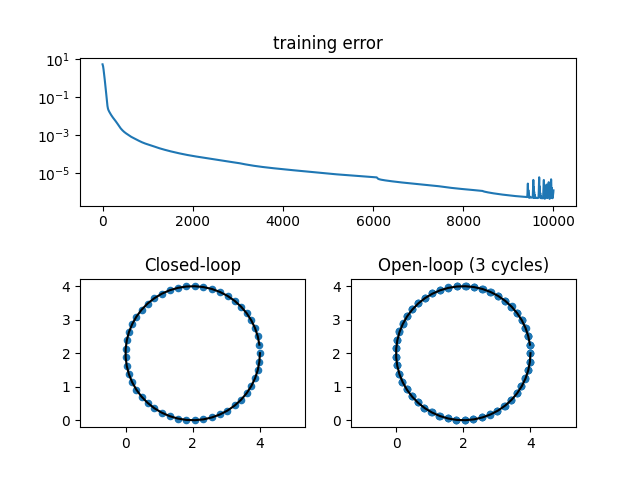

# Assignment 4: drawing a circle by feedforward neural network (FNN)

Use the same circle dataset as problem 3 and draw the circle with the feed-forward model. It is also an open-loop policy but have access to $`l_{0}`$ to $`l_{3}`$.

## Script files

- ```dataset.py```: The same circle dataset as assignment 3. Provide training data of shape $`[N, L, H_{in}]`$, where $`N`$ is batch size, $`L`$ is sequence length, and $`H_{in}`$ is input size.
- ```model.py```: The FNN class implementation.
- ```train_fnn.py```: The main script to train the FNN model.

## Learning result

In ```train_fnn.py```, the FNN model has 64 hidden neural units. The initial learning rate of Adam optimizer is set as 0.001, and learnable parameters of the FNN are updated for 10,000 times. The training loss and predicted points by closed- and open-loop policies shown in the figure. In the open-loop policy case, the RNN is imposed to predict 150 steps into the future. Therefore, the predicted points would draw three cycles of circle (50 steps per cycle). The results of assignment 4 look similar with assignment 3.




## Checkpoints

Important checkpoints are same as assignment 3. The FNN needs no ```nn.RNNCell```.

Check the open-loop policy. Trained FNN has access to the first FOUR points $`l_{0}`$ to $`l_{3}`$.
