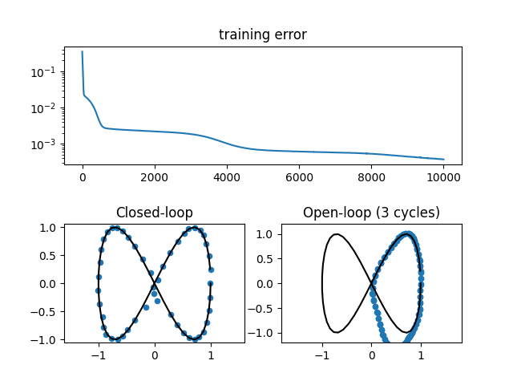

# Assignment 5: drawing a Lissajous curve by RNN and FNN

Repeat problems 3 and 4 but draw a Lissajous curve of infinity shape $`x=\sin (t+\frac{1}{2}\pi), y=\sin (2t)`$ instead.

## Script files

- ```dataset.py```: Provide training data of shape $`[N, L, H_{in}]`$, where $`N`$ is batch size, $`L`$ is sequence length, and $`H_{in}`$ is input size.
- ```model.py```: The RNN and FNN classes implementation.
- ```train_rnn.py```: The main script to train the RNN model.
- ```train_fnn.py```: The main script to train the FNN model.

## Learning result

In ```train_rnn.py```, the RNN model has 64 hidden neural units. The initial learning rate of Adam optimizer is set as 0.001, and learnable parameters of the RNN are updated for 10,000 times. The training loss and predicted points by closed- and open-loop policies shown in the figure. In the open-loop policy case, the RNN is imposed to predict 150 steps into the future. Therefore, the predicted points would draw three cycles of circle (50 steps per cycle).


In ```train_fnn.py```, the FNN model also has 64 hidden neural units and is trained under the same configuration as the RNN model. The learning results are shown in the following figure. The FNN cannot not draw the lissajous curve by open-loop policy. 



Actually, the FNN model can learn to predict the lissajous curve by using open-loop policy in this assignment setting. Depending on the random seed, the FNN model may draw an infinity shape. See additional questions.

## Checkpoints

1. Is the training data is correct?
    - lissajous $`x=\sin (t + \frac{1}{2}\pi), y=\sin (2t)`$,
    - 50 steps.
1. Do the neural network models use a proper activation in the output layer? Consider the range of predicted output again.
    - This assignment imposes the models to predict the lissajous curves with the range [-1.0, 1.0], so the predicted outputs must include [-1.0, 1.0]. ```tanh``` function is not good because ```tanh``` does not include -1.0 and 1.0. In the sample script, a custom activation introduced by Yann LeCun is used.
1. For training the RNN model, the training data must be fed as sequences.
1. After training, can the RNN and FNN predict by using open-loop policy?
    - Open-loop policy means the predicted outputs are reused as the next inputs.

## Additional questions

As mentioned in result section, the FNN model also has a potential to predict the lissajous curve by using open-loop policy in this assignment setting. Now consider why the FNN can solve this regression problem.

1. Confirm that the FNN model can predict the lissajous curve by using open-loop policy in the current setting. If you've confirmed, go next questions.
1. Change the number of data points $`T`$ to 49, then train the FNN model again. Check differences between the original and the current learning results.
1. Consider why the FNN model can learn to predict the lissajous curves in the original setting. There are the hints.
    - Why the FNN theoretically cannot predict the infinity shape?
    - When the FNN cannot predict the infinity shape?
    - What is the difference between the number of data points $`T=50`$ and $`T=49`$?

## Answer for additional questions

First, when the number of data points is $`T=49`$, the FNN cannot learn to predict the lissajous curve by using open-loop policy. And the reason why the FNN can predict the lissajous curve when $`T=50`$ is that training dataset does not include an intersection point $`(0, 0)`$. 

Theoretically, the FNN cannot predict sequences with intersections because there are no histories at the intersections. In this assignment, the intersection point is $`(0, 0)`$, so the FNN confuse the next prediction at $`(0, 0)`$. However, the dataset with 50 points has no intersections $`(0, 0)`$ then enables the FNN to define the prediction around the intersection. When using dataset with 49 points, the intersections $`(0, 0)`$ are included in the dataset, so the FNN cannot learn prediction by using open-loop policy.
